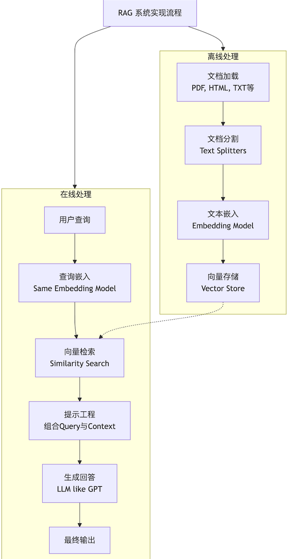

# RAG (检索增强生成) 实现流程详解

## 1. 概述

**RAG (Retrieval-Augmented Generation)** 是一种将信息检索（IR）系统与生成模型（如大型语言模型LLMs）相结合的架构。其核心思想是在生成回答之前，先从外部知识库中检索相关信息，然后将这些信息作为上下文提供给LLM，从而生成更准确、更相关且更具事实性的回答，有效缓解了LLMs的“幻觉”问题。

## 2. 核心组件

一个典型的RAG系统包含三个核心组件：
1.  **检索器 (Retriever)**：从知识库中查找与用户查询最相关的文档片段。
2.  **外部知识库 (Vector Store)**：存储海量文档数据及其向量嵌入的数据库。
3.  **生成器 (Generator)**：通常是一个大型语言模型（LLM），它根据检索到的上下文和用户查询生成最终答案。

## 3. 实现流程步骤

以下是构建一个RAG系统的标准流程，可分为“索引”和“查询”两个主要阶段。



### 阶段一：索引 (Indexing) - 离线预处理

此阶段是为知识库创建可搜索索引的准备工作，通常是离线完成的。

#### 步骤 1: 文档加载 (Data Loading)
-   **目标**：从各种数据源（如PDF、Word、HTML、Markdown、Notion、MySQL等）加载原始文档。
-   **实现**：使用文档加载器库。
    -   **Python工具**：`LangChain` 的 `DocumentLoader`、`LlamaIndex` 的 `data_connectors`、`Apache Tika`、`UnstructuredIO`。
    -   **输出**：原始的 `Document` 对象列表，每个 `Document` 通常包含 `page_content`（文本内容）和 `metadata`（元数据，如来源、页码等）。

#### 步骤 2: 文档分割 (Splitting/Chunking)
-   **目标**：将长文档切分成更小的、语义上有意义的块（chunks）。
-   **为什么重要**：LLM有上下文窗口限制，且检索小而相关的块比检索大文档更高效。
-   **实现**：使用文本分割器。
    -   **Python工具**：`LangChain` 的 `TextSplitter`（如 `RecursiveCharacterTextSplitter`, `TokenTextSplitter`）。`LlamaIndex` 的 `NodeParser`。
    -   **关键参数**：`chunk_size`（块大小，如500字符）、`chunk_overlap`（块重叠，如50字符，用于保持上下文连贯）。

#### 步骤 3: 向量嵌入 (Embedding)
-   **目标**：将文本块转换为数值向量（embeddings）。这些向量在向量空间中捕获文本的语义含义，语义相似的文本会有相似的向量。
-   **实现**：调用嵌入模型（Embedding Model）。
    -   **Python工具/模型**：
        -   **库**: `sentence-transformers`, `OpenAI` Python SDK, `LangChain` 的 `Embeddings` 模块。
        -   **模型**: `all-MiniLM-L6-v2`, `text-embedding-ada-002` (OpenAI), `bge-large-en-v1.5`, `M3E` (中文) 等。
    -   **输出**：每个文本块对应一个高维浮点数向量（例如，维度为768或1536）。

#### 步骤 4: 向量存储 (Vector Storage)
-   **目标**：将文本块及其对应的向量嵌入存储到一个高效的、支持相似性搜索的数据库中。
-   **实现**：使用向量数据库（Vector Database）或向量库。
    -   **Python工具**：
        -   **向量数据库**：`Chroma` (轻量级), `Pinecone` (云服务，托管), `Weaviate` (开源，功能丰富), `Qdrant`, `Milvus`。
        -   **向量库**：`FAISS` (Facebook AI Similarity Search，本地库，无需完整数据库功能)。
    -   **过程**：将上一步生成的所有 `(vector, text_chunk, metadata)` 对插入到向量数据库中。

---

### 阶段二：查询/推理 (Retrieval & Generation) - 在线处理

此阶段在用户提出查询时实时发生。

#### 步骤 1: 查询嵌入 (Query Embedding)
-   **目标**：将用户的原始查询（query）转换为向量嵌入。
-   **实现**：使用与**索引阶段步骤3** **完全相同**的嵌入模型来处理用户查询。
    -   **Python工具**：同上 (`sentence-transformers`, `OpenAI` 等)。

#### 步骤 2: 检索 (Retrieval)
-   **目标**：从向量数据库中找出与查询向量最相似的 `k` 个文本块。
-   **实现**：在向量数据库中进行相似性搜索（Similarity Search）。
    -   **算法**：通常使用余弦相似度（Cosine Similarity）、点积（Dot Product）或欧几里得距离（L2 Distance）。
    -   **Python工具**：向量数据库或 `FAISS` 提供的 `similarity_search` 或 `query` 方法。
    -   **输出**：Top-k个最相关的文本块及其源文档元数据。

#### 步骤 3: 提示工程/上下文增强 (Prompt Engineering/Context Augmentation)
-   **目标**：将检索到的上下文（Context）和用户的原始查询组合成一个结构化的提示（Prompt），提供给LLM。
-   **实现**：设计提示模板。
    -   **Python工具**：`LangChain` 的 `PromptTemplate`, `LCEL`。`LlamaIndex` 的提示功能。
    -   **模板示例**：
        ```python
        template = """
        请仅根据以下提供的上下文信息来回答问题。如果上下文信息中不包含答案，请直接说'根据已知信息无法回答该问题'，不要编造答案。

        上下文：
        {context}

        问题：{question}
        答案：
        """
        ```
    -   **过程**：将检索到的多个文本块拼接成 `context` 字符串，并与 `question` 一起填入模板。

#### 步骤 4: 生成 (Generation)
-   **目标**：将组装好的提示发送给LLM，并获取生成的答案。
-   **实现**：调用LLM的API或本地模型。
    -   **Python工具/模型**：
        -   **API**：`OpenAI` (`gpt-3.5-turbo`, `gpt-4`), `Anthropic` (`claude-3`), `Cohere`。
        -   **本地模型**：通过 `LlamaIndex`, `LangChain`, `vLLM`, `Hugging Face Transformers` 调用 `Llama 3`, `Mistral`, `ChatGLM` 等。
    -   **输出**：LLM生成的、基于所提供的上下文的最终自然语言答案。

## 4. Python代码实现示例 (使用LangChain和Chroma)

以下是一个高度简化的代码示例，展示了核心步骤。

```python
# 安装必备库: pip install langchain langchain-community langchain-openai chromadb sentence-transformers

from langchain_community.document_loaders import TextLoader
from langchain_text_splitters import RecursiveCharacterTextSplitter
from langchain_openai import OpenAIEmbeddings # 或者 from langchain.embeddings import HuggingFaceEmbeddings
from langchain.vectorstores import Chroma
from langchain.prompts import ChatPromptTemplate
from langchain_openai import ChatOpenAI

# 1. 加载文档
loader = TextLoader("my_document.txt")
documents = loader.load()

# 2. 分割文档
text_splitter = RecursiveCharacterTextSplitter(chunk_size=500, chunk_overlap=50)
texts = text_splitter.split_documents(documents)

# 3. & 4. 生成嵌入并存入向量库
# 使用OpenAI的嵌入模型，需要设置OPENAI_API_KEY
embeddings = OpenAIEmbeddings(model="text-embedding-3-small") 
# 也可以使用开源模型: HuggingFaceEmbeddings(model_name="all-MiniLM-L6-v2")
vectorstore = Chroma.from_documents(documents=texts, embedding=embeddings, persist_directory="./chroma_db")
# vectorstore.persist()  # Chroma通常会自动持久化，也可手动调用

# --- 查询阶段 ---
query = "什么是RAG？"

# 5. 检索相关文档
retriever = vectorstore.as_retriever(search_kwargs={"k": 3}) # 检索最相关的3个块
relevant_docs = retriever.invoke(query)

# 6. 组装提示
context = "\n\n".join([doc.page_content for doc in relevant_docs])
template = """
请根据以下上下文回答问题。如果无法回答，请说明。

上下文：{context}

问题：{question}
"""
prompt = ChatPromptTemplate.from_template(template)
formatted_prompt = prompt.format(context=context, question=query)

# 7. 调用LLM生成答案
llm = ChatOpenAI(model="gpt-3.5-turbo") # 需要设置OPENAI_API_KEY
response = llm.invoke(formatted_prompt)
print(response.content)
```

## 5. 高级优化与考量

-   **检索优化**：
    -   **混合搜索 (Hybrid Search)**：结合稠密向量检索（语义匹配）和稀疏向量检索（关键词匹配，如BM25）。
    -   **重排序 (Re-Ranking)**：使用更精细但更耗时的交叉编码器（Cross-Encoder）模型对检索到的Top-k结果进行重新排序，进一步提升相关性。
    -   **元数据过滤**：在检索时添加元数据过滤器（如日期、来源）。
-   **评估**：建立评估体系，使用指标如 `hit rate`（命中率）, `MRR` (平均倒数排名) 和人工评估来衡量RAG管道各个组件的性能。
-   **代理 (Agent)**：更复杂的系统可能让LLM决定是否检索、何时检索以及检索什么。
