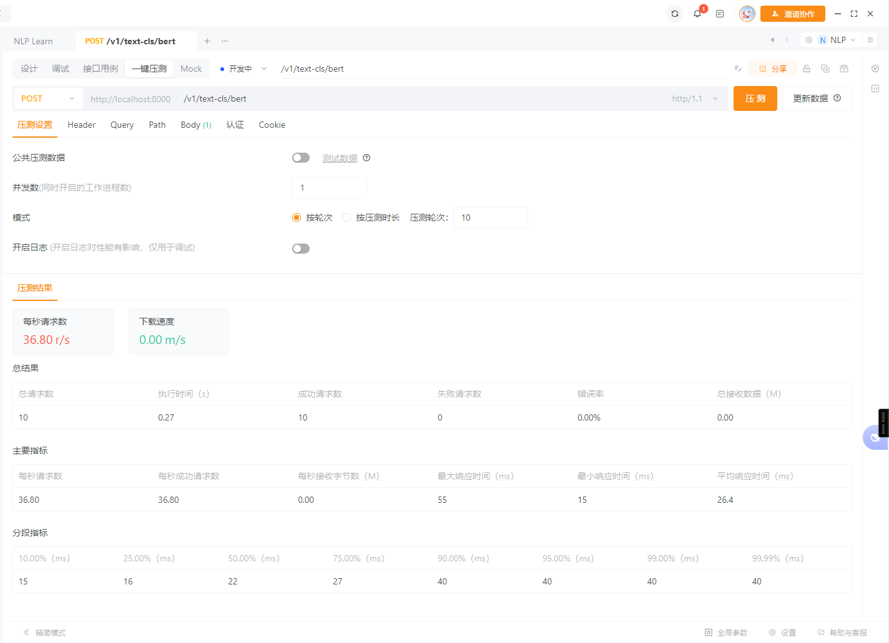
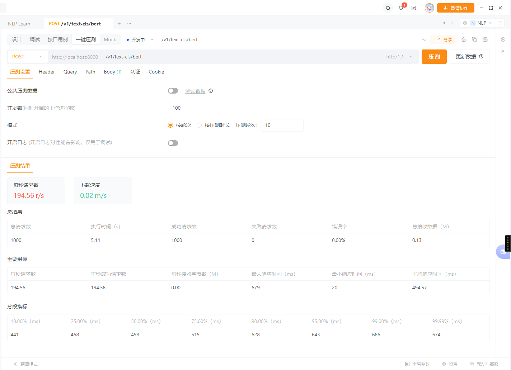

# 训练模型

```commandline
python3 train/train_bert.py
```

# 部署

使用fastapi.exe运行

```commandline
fastapi run main.py
```

使用python.exe运行
main.py中设定主函数入口，可指定IP和端口

```python
if __name__ == '__main__':
    import uvicorn
    from config import HOST, PORT

    uvicorn.run(app, host=HOST, port=PORT)
```

```commandline
python main.py
```

# 压测服务

* 生成压测数据

```commandline
python test/gen_data.py # 生成json数据
```

* ab压测

```commandline
cd test/

ab -n 100 -c 100 -p data.json -T 'application/json' -H 'accept: application/json' 'http://0.0.0.0:8000/v1/text-cls/regex'
ab -n 100 -c 100 -p data.json -T 'application/json' -H 'accept: application/json' 'http://0.0.0.0:8000/v1/text-cls/tfidf'
ab -n 100 -c 100 -p data.json -T 'application/json' -H 'accept: application/json' 'http://0.0.0.0:8000/v1/text-cls/bert'
```

* apipost压测

官网：https://www.apipost.cn/


## 效果

*1并发10轮次*

*5并发10轮次*

*10并发10轮次*

*100并发10轮次*


# 接口

```commandline
curl -X 'POST' \
  'http://localhost:8000/v1/text-cls/bert' \
  -H 'accept: application/json' \
  -H 'Content-Type: application/json' \
  -d '{
  "request_id": "9999",
  "request_text": "分量足，味道好，服务态度好"
}'
```
