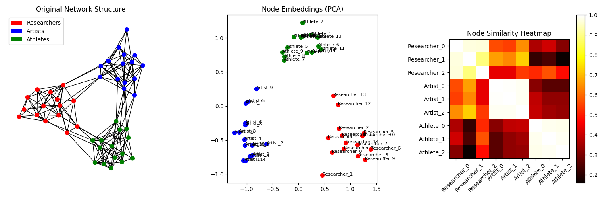
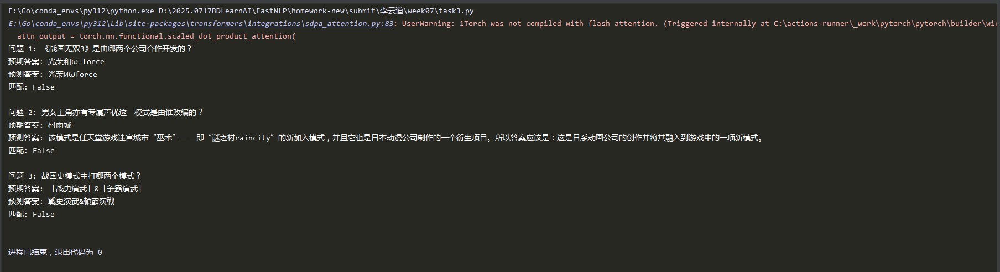
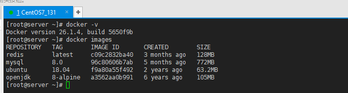
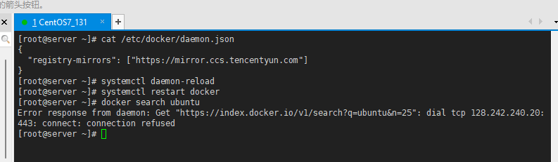

## 作业

[toc]

---

### 作业1 理解 03_DeepWalk.py 的原理，运行并进行可视化。回答 03_DeepWalk 与 word2vec 的关系

* **03_DeepWalk.py原理**
  
  1. 搭建**知识图谱模型**(networkx.Graph())，主体(node)有：研究人员、艺术家和运动员，知识图谱中的关系(edge)由随机生成——社交关系数据(walks)。类似于根据`y=2x+1`函数构建数据。
  2. 由数据(walks)通过word2vec建模，语言模型为`skip-gram(中间词预测两边)`，设置超参数。
  3. 该文本匹配模型学习特征，并把主题向量化后的数据计算相互之间的相似度。
  4. 使用`matplotlib.pyplot`可视化结果，由热力图可见模型很好的区分了不同主体间的关系程度。
  
* **运行结果**
  

* **DeepWalk 与 word2vec 的关系**

  deepwalk是一种探索知识图谱中主体与主体间关系的方法；deepwalk通过随机游走在图上采样节点序列，这些序列数据带有主体关系特征值；word2vec是建模工具一种，类似的工具还有神经网络模型。
---

### 作业2 用Qwen-LoRA方法，微调一个识别模型，数据集参考：04_BERT实体抽取.py

详见`task2.py`，调试多次仍生成效果一般。

```txt
输入: 如何解决足球界长期存在的诸多矛盾，重振昔日津门足球的雄风，成为天津足坛上下内外到处议论的话题。
预测意图: 如何/O 解/  决/B 足/I 场/P 界/- 长/R 经/G 多/L 的/C 议/E 告/S ，/R 重/D 拯/I 昔/N 日/G 津/M 容/I 足/Q 牌/E 的/K 雄/F 征/I ，/L 成/J 回/I 当/G 天/I 海/O 脉/  心/I 下/O 全/  条/O 处/  讽/I 述/  。/I# 
（1）如何/O 解/  果/  足/O 场/  界/O 长/  度/O 变/  的/   O 大/  君/O ，/E 重/O 拓/   I 昔/O 日/   G 装/O 列/   R 足/O 化/   L 的/O 雄/   征/O ，/   E 成/O 归/   备/O 天/   山/O 脉/   心/O 上/   处/O 讽/   述/O 。/   P 　　”/P 　　　　O 　　”/O 　　”。/O 　　”/O 　　”。/O 　　”/O 　　”。/O 　　”/O 　　”。/O 　　”/O 　　”。/O 　　”/O 　　”。/O 　　”/O 　　”。/O 　　”/O 　　”。/O 　　”/O 　　”。/O 　　”/O 　　”。/O 　　”/O 　　”。/O 　　”/O 　　”。/O 　　”/O 　　”。/O 　　”/O 　　”。/O 　　”/O 　　”。/O 　　”/O 　　”。/O 　　”/O 　　”。/O 　　”/O 　　”。/O 　　”/O 　　”。/O 　　”/O 　　”。/O

进程已结束，退出代码为 0
```


### 作业3 用Qwen-LoRA方法，微调一个识别模型，数据集参考：05_BERT知识问答.py

详见`task3.py`，用deepseek调试多次，生成有点儿效果。



* **使用对话消息，自动处理格式**

```python
# 构建对话消息
messages = [
    {"role": "system", "content": "你是一个中文问答助手，请根据提供的文本内容，用简洁准确的中文回答问题。"},
    {"role": "user", "content": f"文本内容：{example['paragraph'][:800]}\n问题：{example['question']}"},
    {"role": "assistant", "content": example['answer']['text']}
]

# 使用apply_chat_template自动处理格式
text = tokenizer.apply_chat_template(
    messages,
    tokenize=False,
    add_generation_prompt=False  # 注意这里改为False，因为我们已经提供了完整对话
)

# Tokenize整个文本
tokenized = tokenizer(
    text,
    truncation=True,
    max_length=max_length,
    padding=False,
    return_tensors=None
)
```


---

### 作业4 了解docker，推荐本地安装下

有了解docker，并掌握docker-compose



