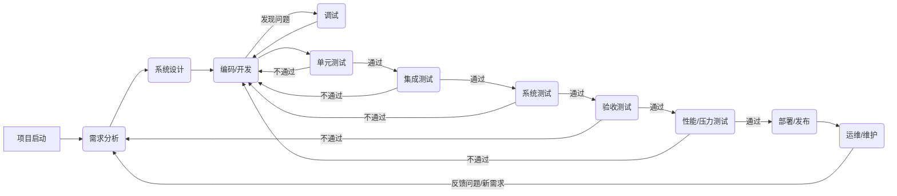

### 项目开发流程

项目的开发流程通常遵循以下步骤，可以以迭代或瀑布式的方式进行，这里展示一个通用的流程：

### 如何进行项目

1. 项目启动： 明确项目目标、范围和关键指标。组建团队，确定角色和职责。
2. 需求分析： 深入了解用户需求，编写详细的需求文档，确保所有利益相关者都对项目目标有共同的理解。
3. 设计： 根据需求文档，进行系统架构、数据库、用户界面等方面的设计。
4. 编码/开发： 按照设计文档，开始编写代码。

### 如何进行调试

调试是找出并修复代码中错误的过程。高效的调试能显著提高开发效率。

1. 日志分析： 在代码中添加详细的日志（如console.log、print、logger.info），记录程序运行的关键信息和变量值。当程序出错时，通过分析日志来定位问题。
2. 断点调试： 使用集成开发环境（IDE）或浏览器的开发者工具，在代码中设置断点。程序运行到断点处会自动暂停，你可以逐行执行代码，查看变量的实时状态，从而追踪问题。
3. 错误重现： 尽可能稳定地重现错误，这是解决问题的第一步。记录下导致错误的操作步骤、输入数据和运行环境。
4. 小步快跑： 当遇到复杂问题时，不要一次性修改太多代码。每次只修改一小部分，并立即测试，以确保你的修改没有引入新的问题。

### 如何测试项目

**1. 单元测试（Unit Testing）：**

- **目的：** 验证代码中最小的独立单元（如函数、方法）是否按预期工作。
- **做法：** 针对每个函数编写测试用例，输入不同的参数，检查返回值是否正确。这通常由开发人员自己完成。
- **工具：** Jest (JavaScript), JUnit (Java), pytest (Python)。

**2. 集成测试（Integration Testing）：**

- **目的：** 验证不同模块或组件组合在一起后，能否协同工作。
- **做法：** 测试多个模块之间的接口和数据流。例如，测试前端的表单提交后，后端是否正确处理并存储数据。

**3. 系统测试（System Testing）：**

- **目的：** 验证整个软件系统是否符合需求文档中的所有要求。
- **做法：** 模拟真实用户的使用场景，对系统的功能、性能、兼容性、安全性等进行全面测试。

**4. 验收测试（Acceptance Testing）：**

- **目的：** 确保软件满足最终用户的需求和期望。
- **做法：** 通常由客户或最终用户执行，根据业务场景来验证系统功能。

### 如何进行压力测试

压力测试（Stress Testing），也叫**负载测试（Load Testing）**，是评估系统在极端负载下的性能表现和稳定性的过程。

1. 确定测试目标： 明确要测试的指标，如系统的最大并发用户数、每秒事务数（TPS）、响应时间和CPU/内存占用。
2. 模拟真实场景： 设计测试用例，模拟大量用户同时访问系统，执行各种操作（如登录、查询、下单）。
3. 逐步增加负载： 从较小的并发数开始，逐渐增加用户负载，观察系统性能的变化。
4. 监控关键指标： 在测试过程中，使用监控工具实时监测服务器的CPU、内存、网络I/O以及数据库的连接数等。
5. 分析结果并优化： 分析测试报告，找出性能瓶颈（如数据库查询慢、代码逻辑效率低等），并进行针对性优化。

