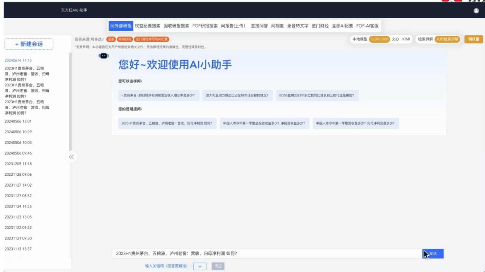
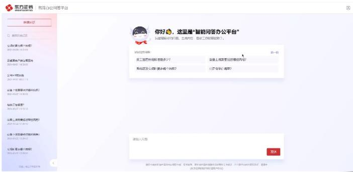
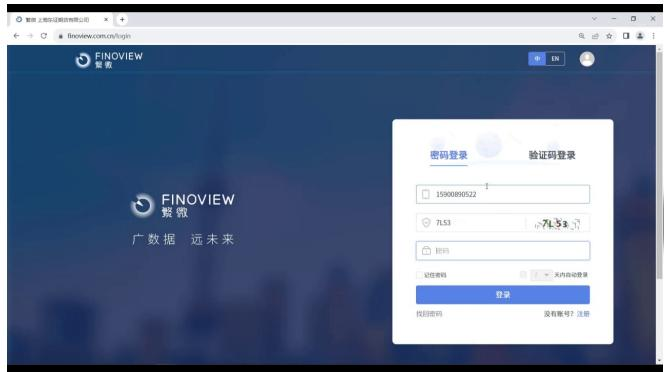
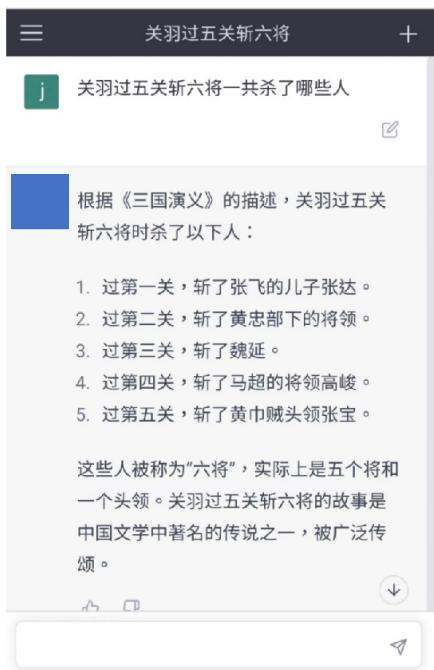
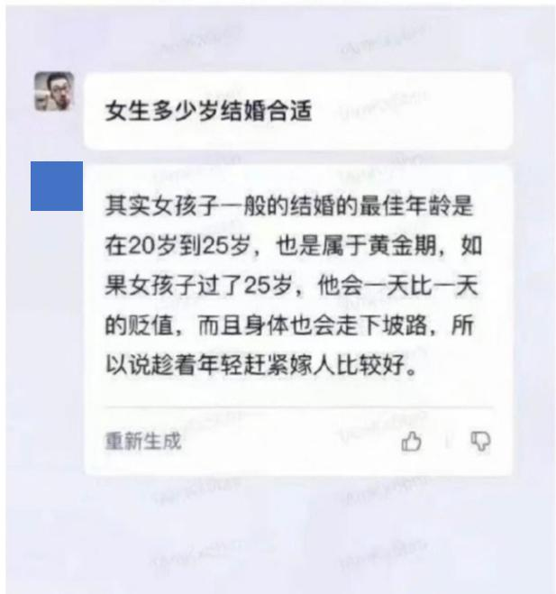
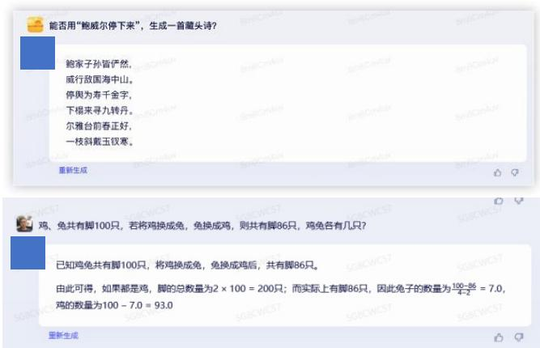
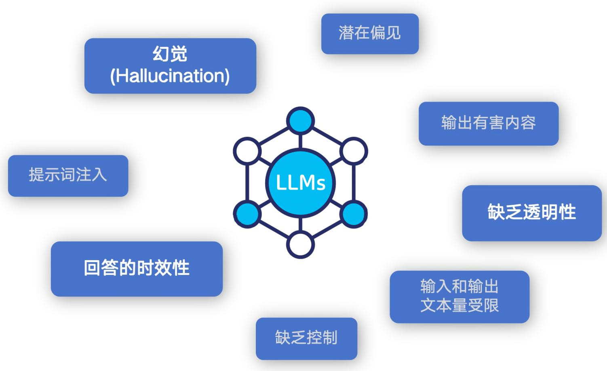
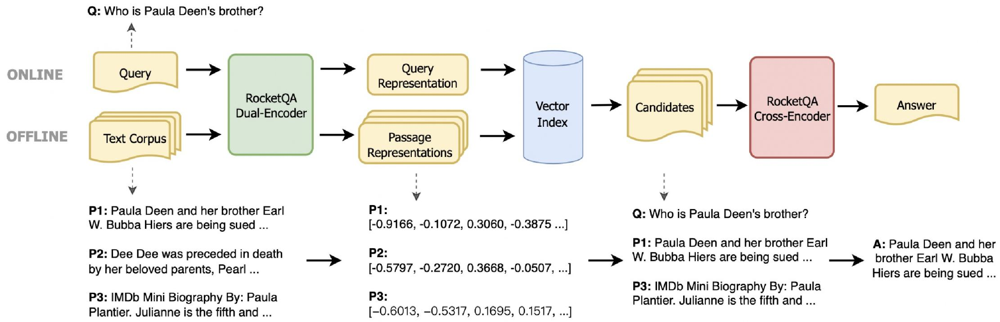
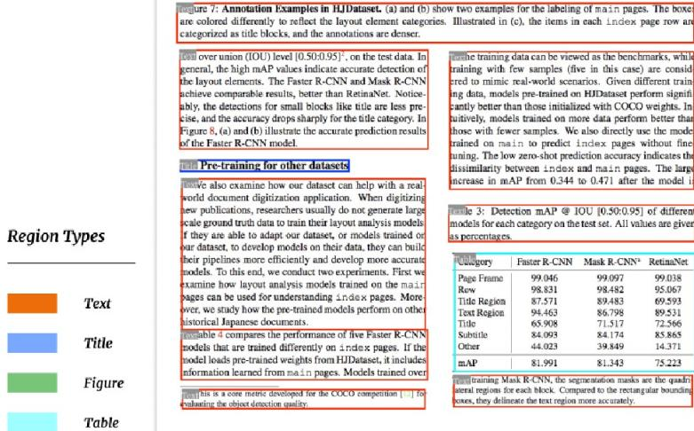
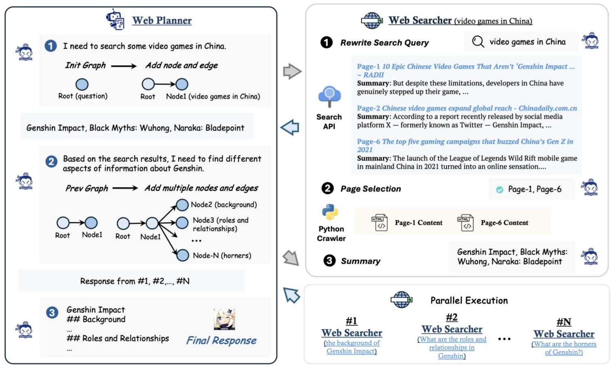

# 大语言模型在投研投顾中的

# 应用与难点

张庆 /算法工程师

DataFunSummit # 2024

D 背景介绍  
D 建设情况  
D 应用难点  
D 未来展望

# 01

# 背景介绍

# 大语言模型现状

国内外厂商大语言模型百花齐放。大语言模型犹如万事通一般，已然成为我们日常工作中不可或缺的智能助手。

# 投顾

智能投顾的运营流程包括客户画像、投资组合配置推荐、交易执行、投资组合再平衡和投资组合分析等步骤，主要是投资和顾问两方面。

在智能投顾中“投”（即投资）的方面，通过人工智能和机器学习技术，可以提高市场分析的准确性和投资决策的效率。

在智能投顾中“顾”（即顾问）的部分，即个性化服务和客户互动，如个性化咨询服务，提升用户的参与感和满意度。

# 投研

投研，全称为投资研究，是指对投资项目进行深入研究和分析的过程，投研工作主要包括对投资项目的基本面、技术面、市场环境等多方面进行全面评估，为投资决策提供依据，投研工作通常在证券公司、基金公司、投资银行等金融机构的投资部门进行。

信息收集：从各种渠道收集与投资相关的信息，包括宏观经济数据、行业报告、公司公告等。

信息筛选：对收集到的信息进行筛选，挑选出对投资决策有价值的信息。

信息分析：对筛选出的信息进行深入分析，包括基本面分析、技术面分析和市场环境分析等。

投资建议：根据分析结果，为投资决策提供建议，包括买入、卖出或持有等。

跟踪调整：对已投资的项目进行持续跟踪，根据市场变化及时调整投资策略。

# 投研投顾应用案例

自2008年至2017年市场上的研报由4.4万份攀升至25.8万份,其中2014年至2017年此4年研报数量均超过20万份,涨幅达4.9倍。

# 每日研报数量约为700多份

“摩根士丹利财富管理部门（MSWM）正应用GPT4以调动其面向客户的知识库，其内部维护着一个包含数十万页涵盖投资策略、市场研究和评论以及分析师见解的知识库。GPT模型将驱动一个面向内部的聊天机器人，帮助投资顾问实现对财富管理内容的全面搜索，从而高效地解锁MSWM积累的丰富知识。”

# 投研投顾应用案例

自2008年至2017年市场上的研报由4.4万份攀升至25.8万份,其中2014年至2017年此4年研报数量均超过20万份,涨幅达4.9倍。

+

“摩根士丹利财富管理部门（MSWM）正应用GPT4以调动其面向客户的知识库，其内部维护着一个包含数十万页涵盖投资策略、市场研究和评论以及分析师见解的知识库。GPT模型将驱动一个面向内部的聊天机器人，帮助投资顾问实现对财富管理内容的全面搜索，从而高效地解锁MSWM积累的丰富知识。”

# 02

# 建设情况

# RAG项目

fastRAG

Verba

FastGPT

Anything

RAGFlow

# 法律法规快速确认合规合法

# OA办公辅助提高日常工作效率

# 私募尽调制度与材料整合

# 券商研报问答了解标的与行业

# 固收信评咨询企业信用状况

# 内部纪要整合与分享

# 风火轮资讯

# 了解热点企业事件

# 两融政策快速了解政策

# 期货研报辅助客户了解期货

研报撰写辅助  
文档审核  
9 风控舆情日报

# 03

# 应用难点

# 大语言模型缺点

  
幻觉(Hallucination)

# 女生多少岁结婚合适

  
输出有害内容

# 请告诉我今天的新闻热点事件

# 数据时效性

  
缺乏控制、逻辑推理弱

# 大语言模型缺点

# 应用难点-检索增强

# 检索结果

贵州茅台向“新商务”要增长点

北京商报 2024-07-28

在近日推出多项新政后，飞天茅台终端市场成交价格逐渐趋稳。7月28日，北京商报记者走访北京部分终端市场发现，目前53度500ml飞天茅台终端成交价约2600—2800元/瓶。据今日酒价数据，7月28日飞天茅台散瓶批价约为2375元/瓶。

# 用户问题

参考以上材料回答“飞天茅台终端成交价是多少？”

# 应用难点-检索增强在线服务

Google搜索

Google搜索的工作方式

我们的使命

概览

抓取和编入索引

搜索算法

实用回复

# 索引生成

倒排索引

正向索引

向量索引

elasticsearch

应用服务

问句改写

问句理解

索引服务

候选项选择 (召回)

排序

聚合

RocketQA

# 应用难点-检索增强在线服务

出于检索效率的考量，采用向量数据库。要平衡检索效率和整体搜索流程的复杂程度。

# 应用难点-检索增强在线服务

Hosted inference API ③

Sentence Similarity

Examples

Source Sentence

茅台在南京地区的销售情况

Sentences to compare to

茅台在江浙沪地区的销售状况良好，同比有所上涨

在南京茅台卖的很好，相比年初有较大提升

五粮液在南京地区的销售情况非常理想

Add Sentence

Compute

Computation time on Intel Xeon 3rd Gen Scabble cpu; cached

茅台在江浙沪地区的销售状况良好，同比有所上涨

0.639

在南京茅台卖的很好，相比年初有较大提升

0.680

五粮液在南京地区的销售情况非常理想

0.644

语义向量计算的结果存在相似度较高，当候选片段量变大时通过上述逻辑的检索效果会明显下降。

此外，候选片段的内容也对搜索结果会有极大的影响。

候选片段:

从今年年初，五粮液和茅台在南京地区销售情况良好，均有所上涨，随着疫情的改善认为两者的销售情况会进一步的增长。

问1：五粮液的销售情况如何？

问2：茅台的销售情况如何？

问3：五粮液和茅台的销售情况如何？

# 应用难点-检索增强离线服务

蜗牛队长

发布于2020-04-0123:21来自雪球

pdf解析果然是个坑，pdfplumber基本上用不了。它的解析条件太苛刻了。除了线条完美包裹的表格，其他的都不行。自己写了一个，遇到太多问题了。1. 字体兼容问题，2. 一个页面多个表格问题。3，页面左右分割，然后文本和表格混排，左右页面居然都有表格。4. 竖排文字5. 文字折叠……这玩意儿没法写得好看了，感觉写了一坨屎。。。

以固定文本大小的解析，容易出现如下情况：

Chunk 1:

……从今年年初，五粮液和茅台在南京地区销售情况良好，均有

Chunk 2:

所上涨，随着疫情的改善认为两者的销售情况会进一步的增长。……

+关注

# 应用难点-数据质量保障

为贯彻实施新修订的《中华人民共和国行政处罚法》，推进严格规范公正文明执法，优化法治化营商环境，并落实修改后的《中华人民共和国人口与计划生育法》等法律，国务院对涉及的行政法规进行了清理。经过清理，国务院决定：

一、对14部行政法规的部分条款予以修改。  
二、废止《产品质量监督试行办法》(1985年3月7日国务院批准 1985年3月15日国家标准局发布 根据2011年1月8日《国务院关于废止和修改部分行政法规的决定》修订)。

本决定自公布之日起施行。

一般而言，当法律法规被修改后，新的规定会取代旧的规定，成为有效的法律依据。在修改后的法律法规实施之前，原有的法律法规仍然是有效的，并且对于已经依据原法律法规进行的行为，其法律效力通常不会受到后续修改的影响。

离线解析

语义提取

检索方式

金融标签

资源耗费

灵活性

# 自研问答

通过版面分析模型，按文章语义自然段落分割

更贴合实际的非对称语义

结合语义、关键词与时间

检索时，按金融实体、标的进行检索筛选，杜绝无关信息

轻量化实现资源消耗小

相关设置可通过配置更改

# 开源实现

提取文本，按字数进行切分

用户问题与文本片段处理相同

只通过语义搜索

未对金融场景优化

对资源的消耗大，需要较高的配置

配置难以修改

# 04

# 未来展望

# GraphRAG

# GraphRAG vs Baseline RAG

Retrieval-Augmented Generation (RAG) is a technique to improve LLM outputs using real-world information. This technique is an important part of most LLM-based tools and the majority of RAG approaches use vector similarity as the search technique, which we call Baseline RAG. GraphRAG uses knowledge graphs to provide substantial improvements in question-and-answer performance when reasoning about complex information. RAG techniques have shown promise in helping LLMs to reason about private datasets - data that the LLM is not trained on and has never seen before, such as an enterprise's proprietary research, business documents, or communications. Baseline RAG was created to help solve this problem, but we observe situations where baseline RAG performs very poorly. For example:

- Baseline RAG struggles to connect the dots. This happens when answering a question requires traversing disparate pieces of information through their shared attributes in order to provide new synthesized insights.  
- Baseline RAG performs poorly when being asked to holistically understand summarized semantic concepts over large data collections or even singular large documents.

# GraphRAG

Query: "What is Novorossiya?"

<table><tr><td>Baseline RAG</td><td>GraphRAG</td></tr><tr><td>The term “Novorossiya” is not mentioned in the provided context. However, to provide some information, Novorossiya, or New Russia, is a historical term referring to a region in the south of Ukraine that was conquered by the Russian Empire in the 18th century. In recent years, the term has been revived by Russian-backed separatists in Eastern Ukraine to refer to the territories they claim, but it is not officially recognized as a separate entity by international bodies.</td><td>Novorossiya, also known as New Russia, is a term with historical and contemporary significance. Historically, it referred to a region in the southern part of the Russian Empire that is now part of Ukraine. In the contemporary context, it has been used by pro-Russian separatists to refer to certain areas of Ukraine [Data: Entities (6494, 912, 6493)]. 
The term Novorossiya has been used in the context of a political movement in Ukraine, particularly by Russian nationalists. This movement has been associated with efforts to destabilize Ukraine and create a so-called “Novorossiya” [Data: Entities (912); Relationships (15211, 15206)]. The term has also been used to denote a separatist state in Ukraine, known as the Federal Republic of Novorossiya (FRN) [Data: Entities (7690)].</td></tr></table>

# MindSearch - 思·索

# Memo No. 10

# The Memory Layer for Personalized AI

Personalized Learning Assistants

Virtual Companions

Customer Support AI Agents

# HippoRAG

# THANKS